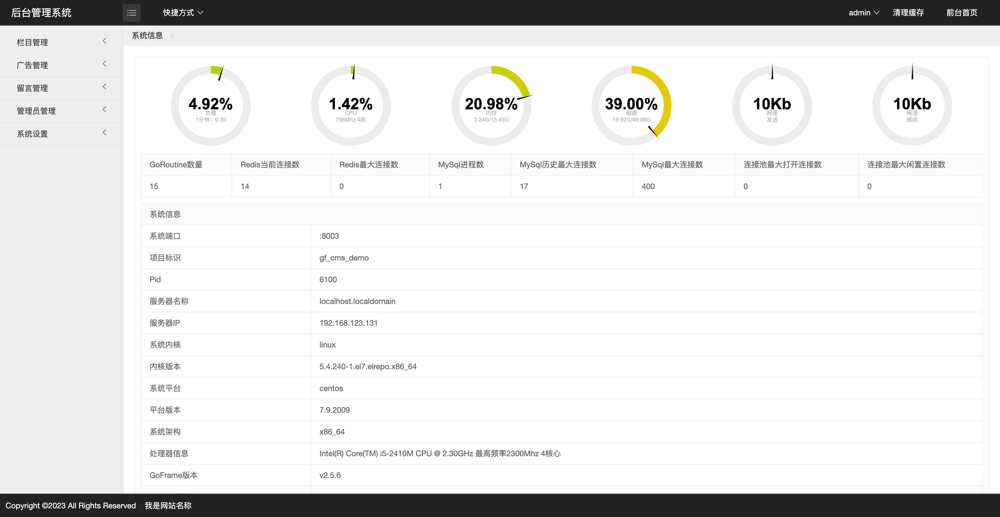
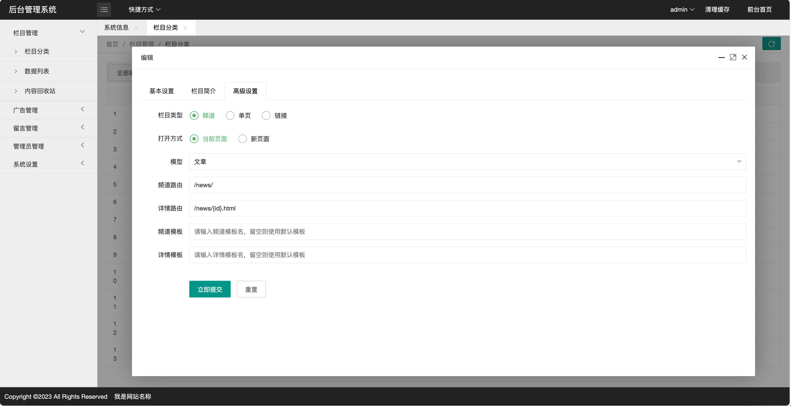
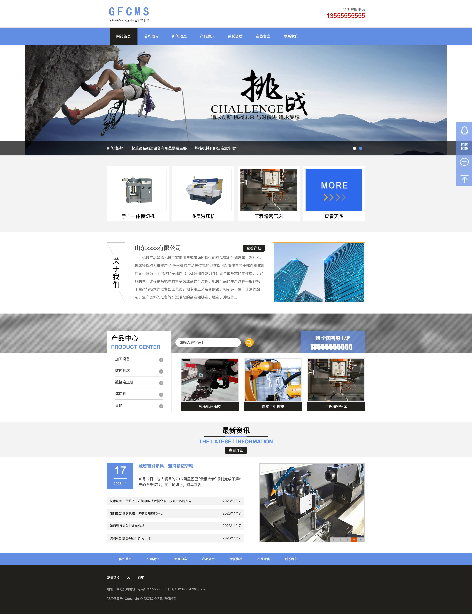

# 基于GoFrameV2 的网站内容管理系统
> 前台演示地址：[demo-pc.linklink.fun](http://demo-pc.linklink.fun) （自动跳转移动端）

> 移动演示地址：[demo-m.linklink.fun](http://demo-m.linklink.fun)

> 后台演示地址：[demo-pc.linklink.fun/admin](http://demo-pc.linklink.fun/admin)
>
> ``
> 用户名：admin
> ``
>
> ``
> 密码：123456
> ``

> 📱 新增部署在arm架构手机内的演示地址：[mi8-gfcms.linklink.fun/admin](http://mi8-gfcms.linklink.fun/admin)
>
> 部署环境为：小米8手机 -> LinuxDeploy容器 -> CentOS7
>
> PC和移动端地址同上，用户名密码同上
> 
> 手机不可能随时开机并运行项目，无法访问请提交issue联系我

> 安装步骤
> 
> 1、导入gfcms_demo.sql到数据库
>
> 2、复制配置文件
>
> <code>cp manifest/config/config.yaml.example manifest/config/config.yaml</code>
> 
> 3、修改config.yaml的数据库配置、redis配置
>
> 4、修改config.yaml域名绑定，mobileHost为移动端绑定域名，pcHost为PC端绑定域名，
> mobileHost留空不自动跳转移动端，mobileHost和pcHost都留空则使用IP加端口号访问
> 
> 5、下载演示站图片资源，将解压后的uploads文件夹放到项目resource/public文件夹下
> 
> 下载地址：http://pan.linklink.fun/#s/932wYqlg 访问密码：C2Gq7
> 
> 6、编译项目
> 
> 已安装 [gf-cli](https://github.com/gogf/gf-cli) 工具（推荐、开发时必备）<code>gf run main.go</code>
>
> 未安装工具 <code>go build -0 ./main main.go</code>
> 
> 7、启动项目
> 
> ./main

> 目前支持的模型：
> - 文章
> - 图集

> 截图
- 后台

- PC

- 移动

